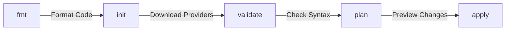

1. tiene reglas especificas de espacios y alineado de simbologia como el simbolo igual
2. instale algunas extensiones en vscode para que me ayudara con el formateo pero ninguna funciono
3. la forma que logré resolver es crear un contenedor local y correr un script que me ayuda en los distintos stages
4. informacion sobre estos elementos estan en mi repo de devopssources
5. detalle sobre los comandos de terraform:


## Validar codigo terraform:

1. tengo una imagen de terraform en mi sistema

![[Pasted image 20250326133259.png]]

2.  en el codebase donde tenga mis terraform, especificamente en el ROOTDIR, debo levantar el container pues tiene un punto de montaje:

```
docker run -d --name tfdev -v $(pwd):/workspace -v ~/.aws:/root/.aws:ro hftamayo/terraformdev:0.1.0
```

![[Pasted image 20250326134025.png]]

3.  leer el contenido del dir workspace montado en el contenedor

```
docker exec tfdev ls -la /workspace
```

![[Pasted image 20250326134209.png]]

4. Desde el repo de devops ejecuto el script para formatear el codigo:

![[Pasted image 20250326134626.png]]

5. el codigo es actualizado en bare metal y listo para hacer un commit

![[Pasted image 20250326134718.png]]

6. Despues de esto el contenedor puede ser destruido

# Understanding Terraform Command Purposes

Let's clarify what each command does:

### 1. `fmt`
- Rewrites Terraform configuration files to a canonical format
- Applies consistent indentation and spacing
- Does NOT validate configuration logic
```bash
./tf-codeformat.sh fmt
```

### 2. `init`
- Initializes a working directory containing Terraform configuration files
- Downloads required providers
- Sets up backend for state storage
- Does NOT validate configuration logic
```bash
./tf-codeformat.sh init
```

### 3. `validate`
- Checks configuration syntax
- Validates internal consistency of attribute names and value types
- Checks resource references
- Does NOT access any remote services, APIs, or state
```bash
./tf-codeformat.sh validate
```

### 4. `plan`
- Shows what changes Terraform will make to infrastructure
- Checks against actual resource state
- Requires provider authentication (AWS credentials)
- Actually connects to AWS to compare state
```bash
./tf-codeformat.sh plan
```

### Command Flow for Validation


`validate` only checks syntax and logic, while `plan` shows actual infrastructure changes.
