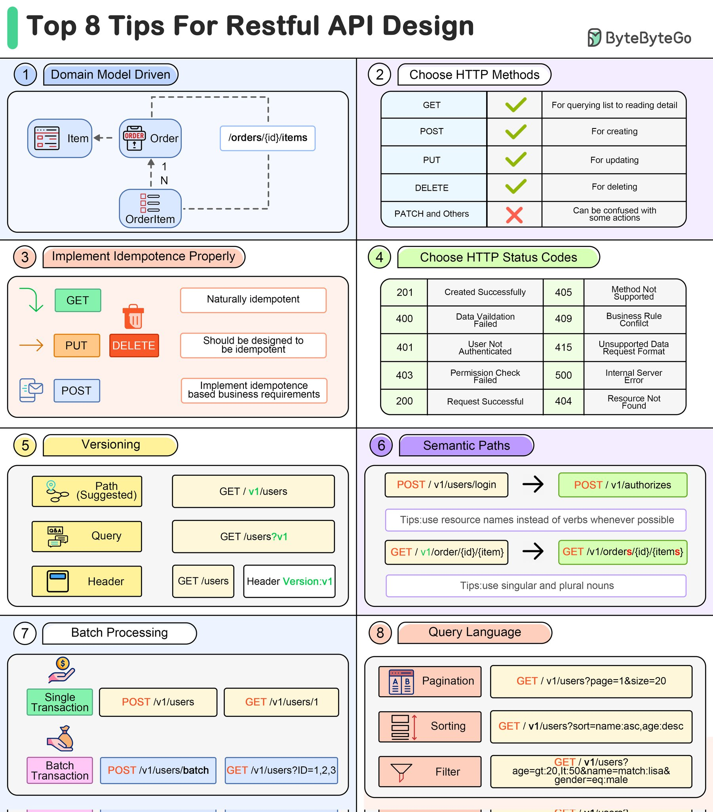
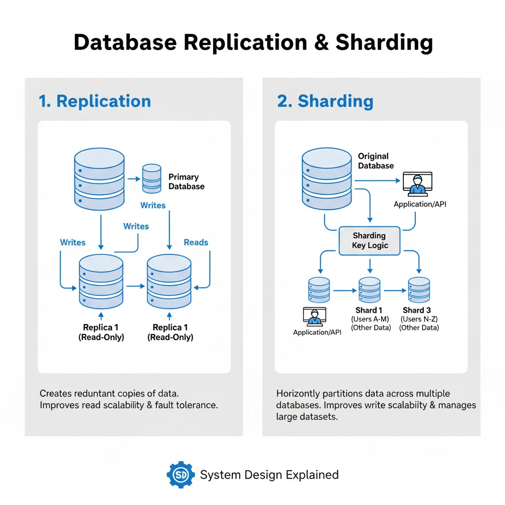

## 🏗️ Architectural Design: Modular Hexagonal
To avoid the "Big Ball of Mud" often found in legacy Spring projects, we implement a **Hexagonal (Ports & Adapters)** structure. This ensures the business logic remains independent of frameworks (Spring), databases (JPA), and external APIs.

### 1. Project Structure
```textmate
com.project.[service]
├── cmd/ (or Application.java)   # Bootstrapping & Configuration
├── core/                        # The "Inside" (Business Logic)
│   ├── domain/                  # Pure Logic & Entities (No @Table/@Entity tags)
│   ├── ports/                   # Interfaces (Required by core, implemented by adapters)
│   │   ├── input/               # Use Case interfaces
│   │   └── output/              # Repository/Client interfaces
│   └── service/                 # Use Case implementations
├── adapters/                    # The "Outside" (Implementation)
│   ├── input/                   # Web/REST Controllers (@RestController)
│   ├── output/                  # Persistence (JPA/QueryDSL) & API Clients
│   └── config/                  # Spring Framework-specific Bean definitions
└── infrastructure/              # Cross-cutting concerns (Security, Exceptions)
```

### 2. Migration Core Principles (Legacy to Modern)
When evolving from traditional Spring Boot to this modern blueprint, we follow these rules:

*   **From "Fat Entities" to "Domain Models"**: We decouple the DB schema from the business logic. JPA entities stay in the `adapters/output` layer, and we map them to pure Java `Records` or `Classes` in the `core/domain`.
*   **Virtual Threads (Project Loom)**: Since we are on **Java 21**, we prioritize `Virtual Threads` over complex reactive programming (WebFlux) for high-concurrency tasks. It provides the same scalability with much simpler, blocking-style code.
*   **Constructor Injection**: We strictly avoid `@Autowired` on fields. All dependencies are injected via constructors (leveraging Lombok's `@RequiredArgsConstructor`) to ensure the code is testable without a Spring Context.
*   **Functional Configuration**: We prefer `@Configuration` classes and `@Bean` definitions over component scanning where possible, making the dependency graph explicit.

### 3. Technology Stack (The Modern Java Suite)
*   **Runtime**: **Java 21 LTS** (Required for Virtual Threads and Pattern Matching).
*   **Framework**: **Spring Boot 3.4+** (Jakarta EE 10+).
*   **Persistence**: **Spring Data JPA** with **QueryDSL** for type-safe complex queries.
*   **Security**: **Spring Security 6** using stateless **JWT (Nimbus JOSE/JWT)**.
*   **Documentation**: **SpringDoc OpenAPI** (Swagger UI) for automated contract generation.
*   **Validation**: **Jakarta Bean Validation** (Hibernate Validator).

### 4. Communication & Protocols
*   **RESTful API**: Our primary external interface, following RFC 7807 (Problem Details) for consistent error handling.
*   **Internal Service Mesh**: For service-to-service communication, we use **Spring Interface Clients** (the modern replacement for Feign).
*   **Observability**: **Micrometer** and **Spring Boot Actuator** are mandatory for exporting metrics to Prometheus/Grafana.

### 5. Operational Strategy
*   **Statelessness**: The application must be 12-factor compliant. No local file storage or HTTP sessions; use **Redis** for distributed caching if needed.
*   **Testing Strategy**:
    *   *Unit Tests*: Focus on the `core/service` layer (JUnit 5 + Mockito).
    *   *Integration Tests*: Use **Testcontainers** for real database/Redis testing during the CI pipeline.
*   **Build Tool**: **Maven** or **Gradle** (with Wrapper) using a modular multi-module approach if the service grows.

### Implementation Note for the Hexagonal Blueprint
Since we are using the **Ports & Adapters** pattern:
*   **Optimistic Locking** is often handled by the `adapters/output` persistence layer via JPA `@Version`, but the `core/service` must be prepared to catch and handle the resulting domain exceptions.
*   **Pessimistic Locking** is typically defined in the `output ports` (interfaces), signaling to the adapter that a "Select for Update" (or equivalent) query is required for that specific use case.

---
## Advanced topics:

### 6. Concurrency Control: Locking Models

In a high-concurrency environment—especially when leveraging **Java 21 Virtual Threads**—managing simultaneous data access is critical to maintaining data integrity. We distinguish between two primary strategies:

#### **Pessimistic Locking**
Pessimistic locking assumes the worst-case scenario: that a conflict is likely to occur. It works by locking a database record the moment it is retrieved, preventing any other transaction from reading or modifying it until the first transaction completes.
*   **Pros**: Guaranteed consistency; prevents "lost updates" at the database level; simple to reason about for high-stakes operations.
*   **Cons**: Higher risk of deadlocks; reduces system throughput as threads must wait for locks to release; can lead to performance bottlenecks in high-scale environments.

#### **Optimistic Locking**
Optimistic locking assumes that conflicts are rare. Instead of locking the record, it uses a version field (usually a `@Version` timestamp or number). When saving, the system checks if the version has changed since it was read. If it has, the transaction fails and throws an exception (e.g., `ObjectOptimisticLockingFailureException`).
*   **Pros**: High concurrency and scalability; no active database locks held during "think time" or long-running logic; ideal for stateless architectures.
*   **Cons**: Requires logic to handle retries or failures when a conflict occurs; can lead to many rolled-back transactions if conflict frequency is underestimated.

#### **When to Use**
*   **Pessimistic**: Use for **critical data** where the cost of a conflict is high or **frequent conflicts** are expected. Classic examples include **banking systems** (processing a balance transfer) or reservation systems where double-booking is strictly prohibited.
*   **Optimistic**: Use for **low-conflict, scalable systems** where performance is a priority. This is the default choice for most **e-commerce inventory** views, CMS systems, or user profile updates where two people rarely edit the same data at the exact same millisecond.

To further modernize our **Modular Hexagonal** blueprint, we must embrace the "Modern Java" idioms introduced in Java 17 and 21. These aren't just syntactic sugar; they are fundamental tools for reducing boilerplate, improving memory efficiency, and maximizing throughput in a high-concurrency environment.

### 7. Modern Java Idioms & High-Performance Concurrency

The flagship features of Java 21 redefine how we write business logic and handle scaling. In our project, we should apply them as follows:

#### **Records: The Data Carrier Standard**
Records are the backbone of our Hexagonal "Domain" and "Web" layers. Being immutable by design, they are perfect for **DTOs** (Web layer) and **Domain Models**.
*   **Usage**: Use Records for all data passing between layers. They eliminate the need for Lombok’s `@Data` or `@Value` and ensure that once a `Result<T>` is created, its state cannot be modified. They are also significantly more memory-efficient than traditional classes when handled by Virtual Threads.

#### **Pattern Matching: Expressive Business Logic**
Java 21’s pattern matching for `switch` and `instanceof` allows us to treat logic as data.
*   **Usage**: This is our primary tool for **Domain Validation** and **Result Handling**. Instead of deep `if-else` chains or complex `try-catch` blocks, use `switch` expressions to handle different types of domain events or response states. This makes our "Use Case" implementations in the `core/service` layer highly readable and exhaustive.

#### **Virtual Threads (Project Loom): Lightweight Scaling**
Virtual Threads remove the "one thread per request" bottleneck of traditional platform threads.
*   **Usage**: We prioritize a **blocking-style synchronous code** model that is easy to debug, but we enable `spring.threads.virtual.enabled=true` to let the JVM handle millions of concurrent operations. This allows us to perform heavy I/O (like multiple DB queries or API calls in a single Use Case) without the cognitive overhead of Reactive programming (WebFlux).

#### **Lambdas & Streams: Functional Data Processing**
While no longer "new," their role is more defined in a modern architecture.
*   **Usage**: Use **Streams** strictly for data transformation within the `adapters/output` (e.g., mapping JPA entities to Domain Records) and for collection processing in the `core`. Keep them readable—if a Stream pipeline exceeds 4-5 lines, refactor it into a named method to preserve the "Clean Code" principles of our blueprint.

#### **Summary of Usage in the Blueprint**
| Feature | Primary Location | Strategic Benefit |
| :--- | :--- | :--- |
| **Records** | `core/domain` & `api/dtos` | Immutability and zero boilerplate. |
| **Pattern Matching**| `core/service` | Exhaustive, readable business rules. |
| **Virtual Threads** | Infrastructure/Global | High scalability with simple blocking code. |
| **Streams/Lambdas** | `adapters/output` | Clean mapping and data transformation. |

To round out our architectural strategy, we must address how the backend communicates "nothing found" scenarios. In a **Modern Hexagonal** system, the handling of `404 Not Found` errors is not just about a missing page, but about meaningful API contracts and security.

### 8. Robust Error Handling: The 404 Strategy

Handling "Not Found" scenarios requires a clear distinction between a missing **API endpoint** and a missing **resource**. To maintain a high-quality developer experience (DX) and secure the system, we follow these principles:

#### **RFC 7807: Standardized Problem Details**
We do not return custom or vague error strings. Instead, we use the **RFC 7807 (Problem Details for HTTP APIs)** standard. When a 404 occurs, the backend returns a JSON object containing a `type`, `title`, `status`, and a `detail` message. This allows the frontend (React/TanStack Query) to programmatically detect the error type and trigger the appropriate "Empty State" or "404 UI" component.

#### **Resource vs. Route Discovery**
*   **Resource Not Found**: If a user requests `/api/companies/999` and ID 999 doesn't exist, the `core/service` layer should throw a specific `DomainEntityNotFoundException`. The `@RestControllerAdvice` in our `infrastructure` layer then maps this to a `404 Not Found`.
*   **Endpoint Discovery (Security)**: To prevent malicious actors from using 404 responses to map our API structure (Endpoint Discovery), we configure **Spring Security** to return a generic 403 Forbidden or a uniform 404 for unauthorized paths. This ensures that an attacker cannot distinguish between a path that "exists but is forbidden" and one that "does not exist at all."

#### **Signaling the Frontend**
Instead of the backend redirecting to an HTML error page, it must strictly remain a data provider. The backend sends the `404` status code along with a specific application-level error code (e.g., `ENTITY_NOT_FOUND`). The frontend intercepts this specific status/code combination to render its own internal `NotFoundView`, keeping the routing logic entirely within the React application.

#### **The "Safe Empty" Pattern**
In our blueprint, we distinguish between **Search** and **Direct Access**:
*   **Direct Access**: (e.g., `getCompanyById`) returns a **404** if the ID is missing.
*   **Search/Filters**: (e.g., `findCompaniesByCriteria`) should return a **200 OK** with an **empty list** `[]`, not a 404. This prevents unnecessary error handling logic on the frontend when a search simply yields no results.

#### **Proactive Handling with Optional**
In the `core/service` layer, our output ports (Repository interfaces) should return `Optional<T>`. This forces the Use Case developer to explicitly handle the "absence" of a value—either by providing a default or throwing the exception that triggers the 404 flow—ensuring that `NullPointerExceptions` never reach the user.

To integrate this into the blueprint, we can add a specific section focused on the **Transactional Integrity** of our Hexagonal layers. This bridges the gap between the theoretical database properties and our actual Java implementation.

### 9. Transactional Integrity: Orchestrating ACID in Hexagonal Layers

In our architecture, the **Application Layer (`core/service`)** acts as the transactional guardian. Since we are decoupling business logic from the database, we must be disciplined in how we manage transaction boundaries to satisfy ACID requirements.

#### **The Service as the Transactional Boundary**
In Spring Boot, we apply the `@Transactional` annotation at the **Service (Use Case)** level, not the Repository level. This ensures **Atomicity**: every operation performed within a single Use Case—such as mapping a Record, persisting to a database, and sending a message to the `logger-service`—is treated as a single "all-or-nothing" operation. If the domain logic determines a rule violation (Consistency), it throws a `DomainException`, triggering a rollback before any data is permanently committed.

#### **Maintaining Consistency Across Adapters**
While a relational database handles "Internal Consistency" (Foreign Keys), our backend handles **"Cross-System Consistency."** For instance, if a Use Case involves updating a record in PostgreSQL and then notifying the `auth-service`, we must ensure the system doesn't enter an inconsistent state if the network fails. We utilize the **Transactional Outbox Pattern** or simple local transaction management to ensure that we never signal a "Success" to the frontend unless the local state change is durable and the side-effect is guaranteed to follow.

#### **Isolation in the Age of Virtual Threads**
With **Java 21 Virtual Threads**, the density of concurrent transactions increases significantly. To maintain **Isolation**, our backend strategy is to:
1.  Default to **Optimistic Locking** (`@Version`) for general resource updates to maximize throughput.
2.  Escalate to **Pessimistic Locking** via the Repository Port for high-contention financial or "quota-based" logic.
3.  Keep transaction windows as "thin" as possible—performing heavy computations or external API fetches *before* opening the database transaction—to reduce lock contention and prevent system-wide latency.

#### **Durability and the "Success" Contract**
We uphold **Durability** by ensuring that our `Result<T, E>` pattern is only returned to the **Web Adapter** once the persistence adapter has successfully received a `COMMIT` confirmation from the database. This prevents "Ghost Successes" where a user receives a confirmation message, but the data is lost due to a mid-commit failure.

---

## Software architecture

### 10. Protocol Decision Matrix: REST, gRPC, and GraphQL

In a Hexagonal architecture, the **Input Adapter** defines the protocol. For our Backoffice service, we don't pick one "winner"; instead, we select the right tool based on who is calling the service and what the "Governor" needs to achieve.

### Architectural Styles:

#### **1. REST (The Pragmatic Default)**
*   **When to use:** For all **Frontend-to-Backend** communication and public-facing APIs.
*   **Why:** It is the most compatible with the modern React 19 / TanStack Query ecosystem. It excels at **Resource Management** (CRUD operations on catalogs, users, and rules).
*   **Governor Note:** We favor "Pragmatic REST," which allows for `/actions/` endpoints for complex business tasks that don't fit a standard `PUT` or `PATCH` (e.g., `POST /api/v1/billing/regenerate-invoices`).

#### **2. gRPC (The High-Speed Internal Lane)**
*   **When to use:** For **Service-to-Service** (Backend-to-Backend) communication within our ecosystem.
*   **Why:** It uses **Protocol Buffers (binary serialization)**, making it significantly faster and more CPU-efficient than JSON. It provides strict, cross-language type safety (e.g., a Go-based `auth-service` talking to a Java-based `backoffice`).
*   **Governor Note:** Use gRPC when the "Governor" needs to push critical configuration updates or verify permissions in real-time across the microservices mesh without the overhead of HTTP/1.1 headers and JSON parsing.

#### **3. GraphQL (The Flexible Data Aggregator)**
*   **When to use:** Rarely in this Backoffice, but potentially for **Complex Reporting Dashboards**.
*   **Why:** It allows the client to request exactly the fields it needs, solving "over-fetching." It is ideal when a single UI view needs to aggregate data from 10 different domain entities (e.g., a "Master Audit View").
*   **Governor Note:** Avoid GraphQL for simple CRUD or business rules. The overhead of maintaining the schema and the complexity of securing deep queries usually outweigh the benefits for a low-concurrency (50 users) administrative tool.

#### **Summary Decision Table**

| Requirement | Preferred Protocol | Reasoning |
| :--- | :--- | :--- |
| **User Interface (React)** | **REST** | Best-in-class tooling and simple caching. |
| **Internal Microservices** | **gRPC** | Maximum performance and binary contract safety. |
| **Complex/Custom Reports** | **GraphQL** | Client-driven data shaping. |
| **Bulk Data Uploads** | **REST (Multipart)** | Standardized handling of large payloads/files. |
| **Real-time Logs/Alerts** | **WebSockets** | Low-latency bi-directional streaming. |

By maintaining this "Hybrid Adapter" strategy, the **Backoffice Governor** remains accessible to the UI while staying high-performance and robust for the rest of the backend infrastructure.

### **11. API Best Practices**



### 12. Performance Guardrails: Eliminating "Slow API" Patterns

In our **Modular Hexagonal** architecture, performance is a cross-cutting concern that spans from the `adapters/output` (database) to the `web/api` layer. We must proactively defend against the five "Silent Killers" of API performance.

#### **1. N+1 Queries**
*   **Definition**: Occurs when the code executes one query to fetch a list of entities (e.g., 50 Companies) and then executes $N$ additional queries to fetch related data for each entity (e.g., the primary contact for each company).
*   **Countermeasure**: Use **Join Fetching** or **Entity Graphs** in Spring Data JPA.
*   **Recommendation**: Monitor your SQL logs during development. If you see dozens of similar queries for a single request, refactor the repository port to use `@EntityGraph` or a custom QueryDSL "fetch join" to retrieve all necessary data in a single round-trip.

#### **2. Missing Database Indexes**
*   **Definition**: The database is forced to perform a "Full Table Scan" to find records because the columns used in `WHERE`, `JOIN`, or `ORDER BY` clauses are not indexed.
*   **Countermeasure**: Implement **Flyway** migrations that include strategic `CREATE INDEX` statements for frequently filtered fields (e.g., `company_id`, `status`, `created_at`).
*   **Recommendation**: Never guess; use `EXPLAIN ANALYZE` on slow queries. Ensure every foreign key and any column used in a search filter has an appropriate index.

#### **3. Chatty Endpoints**
*   **Definition**: An API design that requires the frontend to make multiple sequential calls to populate a single view (e.g., call `/user`, then `/roles`, then `/permissions`).
*   **Countermeasure**: Implement **Aggregator Use Cases** or **DTO Projections**.
*   **Recommendation**: Design endpoints based on "UI Needs" rather than "DB Tables." If the Backoffice Dashboard needs three data points, provide a single `GET /dashboard-summary` endpoint that returns a combined Record.

#### **4. Excessive Data Payloads (Over-fetching)**
*   **Definition**: Returning a massive JSON object with 50 fields when the UI only needs the `id` and `name`. This wastes CPU (serialization), bandwidth, and memory.
*   **Countermeasure**: Use **JPA Projections** (Interfaces or Records) and dedicated **Web DTOs**.
*   **Recommendation**: Never return a `@Entity` directly from a controller. Always map to a thin `Record` in the `core/domain` or a specific DTO in the `web` layer that contains *only* the data required by the contract.

#### **5. Poor Caching Strategy**
*   **Definition**: Re-calculating complex business rules or re-fetching static catalogs (like "Countries" or "Error Codes") from the database on every single request.
*   **Countermeasure**: Implement a **Layered Caching** approach using Spring's `@Cacheable` (with Redis or Caffeine).
*   **Recommendation**: Use **Cache-Aside** for slow-changing catalogs. For the Backoffice Governor, implement "Write-Through" caching so that when a catalog is updated, the cache is evicted immediately, ensuring the 5-50 users always see the latest "Source of Truth."

---

### Implementation Summary for the Blueprint
| Killer | Responsibility Layer | Primary Tooling |
| :--- | :--- | :--- |
| **N+1 Queries** | `adapters/output` (Persistence) | JPA Entity Graphs / QueryDSL |
| **No Indexes** | `infrastructure` (DB Schema) | Flyway Migrations |
| **Chatty Endpoints** | `core/service` (Use Case) | Aggregator Services |
| **Excessive Data** | `web/api` (DTOs) | Java 21 Records / MapStruct |
| **Poor Caching** | `core/service` | Spring Cache + Redis |

To ensure our **Backoffice Governor** remains resilient and future-proof, we must define how the system scales at the data layer. While our current load is low (5-50 users), these strategies are essential for High Availability (HA) and long-term data growth.

### 13. Data Scaling: Replication and Sharding

In a Hexagonal architecture, the "core" remains unaware of how the database is physically distributed. However, the **Persistence Adapter** must be configured to leverage these infrastructure capabilities to ensure the system is both "always-on" and capable of handling growing catalogs.

#### **Database Replication (The Availability Strategy)**
*   **Definition**: The process of copying data from one database server (the **Primary**) to one or more servers (the **Replicas**). In our Spring Boot context, the Primary handles all `WRITE` operations (INSERT, UPDATE, DELETE), while Replicas handle `READ` operations.
*   **Importance**: It provides **High Availability** (if the primary fails, a replica takes over) and **Read Scalability** (offloading heavy reporting queries from the main transaction engine).
*   **Management**: The project manages this via **Read/Write Splitting** in the Infrastructure layer. We configure a routing data source that directs `@Transactional(readOnly = true)` traffic to the replicas, ensuring the "Governor" never lags during heavy data entry.

#### **Database Sharding (The Capacity Strategy)**
*   **Definition**: A horizontal partitioning technique where data is split across multiple independent databases based on a "shard key" (e.g., `company_id` or `region`). Instead of one giant table, you have many smaller tables distributed across different servers.
*   **Importance**: It solves the physical limits of a single server. When a table grows to hundreds of millions of rows (e.g., audit logs or historical absences), sharding ensures that query performance remains constant by only searching a small fraction of the total data.
*   **Management**: For our Backoffice, sharding should be a **last resort**. We manage data volume primarily through **Table Partitioning** (PostgreSQL native feature) or by extracting high-volume data (like logs) into a specialized service (our Go-based `logger-service`). If full sharding is required, it is managed at the Infrastructure level using tools like **Hibernate Shards** or a middleware like **Vitess**, keeping the business logic completely decoupled.

---

### Strategy Summary for the Blueprint
| Technique | Primary Goal | When to Apply |
| :--- | :--- | :--- |
| **Replication** | Reliability & Read Speed | **Mandatory** for Production (High Availability). |
| **Sharding** | Massive Data Volume | Only if a single entity exceeds the vertical limits of the DB. |
| **Partitioning**| Internal Organization | Use for time-based data (e.g., `Logs` by month). |

**Architect's Note:** For a Backoffice Governor, prioritize **Replication** first. It ensures that business rules and catalogs are always reachable, even during database maintenance or localized failures.

### Infograph about replication and sharding


To finalize the performance and scalability section of the blueprint, we must define our caching layers. In a **Modular Hexagonal** system, caching is not just about speed; it is about protecting the "Governor" from redundant processing and providing a smooth experience for the backoffice users.

### 14. Distributed and Local Caching Strategy

Caching is our primary defense against "Chatty Endpoints" and expensive database operations. We implement a **Two-Tier Caching** approach to balance lightning-fast local access with cross-instance consistency.

#### **Layer 1: Local L1 Cache (Caffeine)**
*   **Definition**: An in-memory cache that lives within the JVM process of the specific service instance.
*   **Usage**: Reserved for **Immutable or Near-Static Data**, such as system configuration, localized error messages, or small country/currency catalogs.
*   **Benefit**: Zero network latency. Since these values rarely change, we don't need to coordinate between instances, keeping the "Governor" extremely responsive for frequent UI refreshes.

#### **Layer 2: Distributed L2 Cache (Redis)**
*   **Definition**: A centralized, high-performance data store shared by all backend instances.
*   **Usage**: Used for **Shared State and Dynamic Data**, such as active user sessions, temporary business rule calculations, and the **Token Blacklist** (as seen in our `auth-service`).
*   **Benefit**: Ensures that if a user updates a business rule on Instance A, Instance B immediately sees the change. It is essential for maintaining the **Consistency** of our ACID model across a distributed cluster.

#### **The Cache-Aside Pattern**
The project strictly follows the **Cache-Aside (Lazy Loading)** pattern managed in the `core/service` layer:
1.  The Use Case checks the cache.
2.  If the data is missing (**Cache Miss**), it calls the `output port` to fetch it from the database.
3.  The Use Case then populates the cache for future requests.
4.  **Eviction**: We use `@CacheEvict` on any "Write" operation (Create/Update/Delete) to ensure the cache never serves stale "Source of Truth" data to the backoffice managers.

#### **Frontend Synergy: TanStack Query**
It is important to note that our backend caching is complemented by the **Frontend Cache** (TanStack Query). The backend provides `ETag` headers and `Cache-Control` directives, allowing the React 19 application to avoid making network requests entirely for data that hasn't changed, significantly reducing the load on our Virtual Threads.

---

### Caching Decision Matrix
| Data Type | Cache Layer | Eviction Strategy |
| :--- | :--- | :--- |
| **System Constants** | L1 (Caffeine) | On Startup / Manual |
| **User Permissions** | L2 (Redis) | On Role Change / JWT Expiry |
| **Catalog Items** | L2 (Redis) | On Update (Write-Through) |
| **Complex Reports** | L2 (Redis) | Time-to-Live (TTL) 5-15 mins |

Here is the addition to the blueprint, focusing on the system's ability to withstand failures through the **Resilience** pattern.

### 15. Resilience: The Circuit Breaker Pattern

In a distributed ecosystem—even one as compact as our Java Backoffice and Go-based services—we must design for the "Expectation of Failure." Resilience is the system's ability to remain functional when a component or network link becomes unstable. Our primary tool for this is the **Circuit Breaker**.

#### **The Circuit Breaker (Stability via Isolation)**
The Circuit Breaker pattern is our "Safety Switch" for all remote interactions (REST, gRPC, or external APIs). It prevents a failure in a downstream service—like a temporary outage in the `logger-service`—from causing a **Cascading Failure** in the "Governor" backoffice.
*   **How it Works**: Just like a physical fuse, the breaker monitors the "Output Ports." If the failure rate or latency exceeds a predefined threshold, the circuit **trips (Opens)**. While open, all further calls to that service are blocked immediately.
*   **Fail-Fast & Fallbacks**: Instead of allowing the Java **Virtual Threads** to hang while waiting for a network timeout, the breaker returns a "Fallback" response (e.g., serving cached data or queuing a log locally). This ensures the Backoffice remains responsive to the 5-50 power users, regardless of the health of the rest of the mesh.
*   **Self-Healing**: After a "cooling-off" period, the breaker enters a **Half-Open** state, allowing a small number of trial requests through. If they succeed, the circuit **Closes** and normal operations resume automatically.

#### **Strategic Implementation**
In our **Hexagonal Blueprint**, Circuit Breakers (implemented via **Resilience4j**) are located in the **Infrastructure Layer** (Adapters). This allows our **Core Business Logic** to remain "clean"—the service simply calls a port, and the infrastructure handles the complexity of timeouts, retries, and fallback logic. This pattern is mandatory for any call that crosses the network boundary, ensuring that the "Governor" is the most stable component in the architecture.

To ensure our **Backoffice Governor** remains a transparent and reliable "Source of Truth," we must establish a clear telemetry contract. This ensures that the application provides the necessary data for external monitoring systems to visualize its health and performance.

### 16. Observability: The Metrics & Telemetry Contract

In a modern backend, observability is a first-class citizen. While the visualization platform (Grafana/Prometheus) is external, the backend application is responsible for exposing its internal state through a standardized **Telemetry Contract**. This allows us to move from "reactive" debugging to "proactive" system health management.

#### **1. Standardized Metrics (The Vitals)**
The application must expose a `/actuator/prometheus` endpoint (via **Micrometer**) providing three levels of metrics:
*   **JVM & Virtual Threads**: Specific counters for **Java 21 Virtual Threads**, monitoring for "pinning" (where a virtual thread blocks a platform thread) and carrier thread utilization.
*   **Infrastructure Health**: Connection pool saturation (HikariCP), Redis latency, and Hibernate/JPA query execution times to detect "N+1" or indexing issues before they cause an outage.
*   **Business Success Rates**: Domain-specific counters, such as `absences_created_total` vs `absences_failure_total`. This allows the "Governor" to report not just if the server is up, but if the business logic is successfully enforcing rules.

#### **2. Distributed Tracing (The Request Journey)**
To debug transactions that span across our Java and Go-based services, we implement **Distributed Tracing**. Every incoming request is assigned a unique **TraceID**. This ID must be propagated through every `output port`—whether it’s a REST call to the `auth-service` or a binary gRPC message. This ensures that a single user action can be traced across the entire distributed mesh in our centralized logs.

#### **3. Health & Readiness Probes**
Following the "Cloud-Native" standard, the application provides two distinct health signals:
*   **Liveness**: Indicates if the JVM process is healthy. If this fails, the orchestrator (Docker/K8s) will restart the container.
*   **Readiness**: Indicates if the "Governor" is ready to serve traffic. This only turns "Green" once **Flyway** migrations are complete, the **Redis** cache is warmed up, and the **Database** connection is established.

#### **4. Structured JSON Logging**
Logs are treated as structured data, not plain text. All logs are emitted in **JSON format**, including the `TraceID`, `CorrelationID`, and `UserSessionContext`. This ensures that our `logger-service` can index them with high precision, allowing architects to filter and aggregate logs by user, action, or specific business module without complex regex parsing.

### 17. Monitoring: avoid reinventing the wheel

*   **Observability and monitoring will be based using Graphana+Prometheus+Loki+AlertManager+Thanos**
*   **We will use Grafana Dashboards to visualize the metrics and traces**
*   **We will use Loki to store the logs**
*   **We will use AlertManager to send alerts**
*   **We will use Thanos to store the metrics**
*   **Avoid the temptation to code a health check specific module**

To maintain a high-authority Backoffice Governor, we strictly adhere to the principle of **"avoiding reinventing the wheel"** for infrastructure concerns. Monitoring and observability are treated as independent services, decoupled from our business logic.

*   **Standardized Stack**: Our observability ecosystem is powered by **Grafana**, **Prometheus**, **Loki**, **AlertManager**, and **Thanos**.
    *   **Grafana**: The single pane of glass for visualizing system vitals, Virtual Thread performance, and business KPIs.
    *   **Prometheus & Thanos**: Prometheus handles local metric scraping, while **Thanos** provides long-term storage and high availability for historical data.
    *   **Loki**: Our centralized engine for **Structured JSON Logging**, allowing us to correlate logs with metrics via TraceIDs.
    *   **AlertManager**: The brain for proactive notifications (Slack, Email, PagerDuty) based on predefined business and infra thresholds.
*   **Zero Custom Health Modules**: We strictly avoid coding bespoke health-check modules or custom dashboard UIs in the React/Spring layers. Instead, we expose standardized endpoints (`/actuator/prometheus`) and let the dedicated monitoring infrastructure handle the collection and visualization.
*   **Architectural Benefit**: This separation ensures that even if the Java or Go services are under heavy load or failing, the observability stack remains independent and operational, providing the "Black Box" data needed for post-mortem analysis.

---
