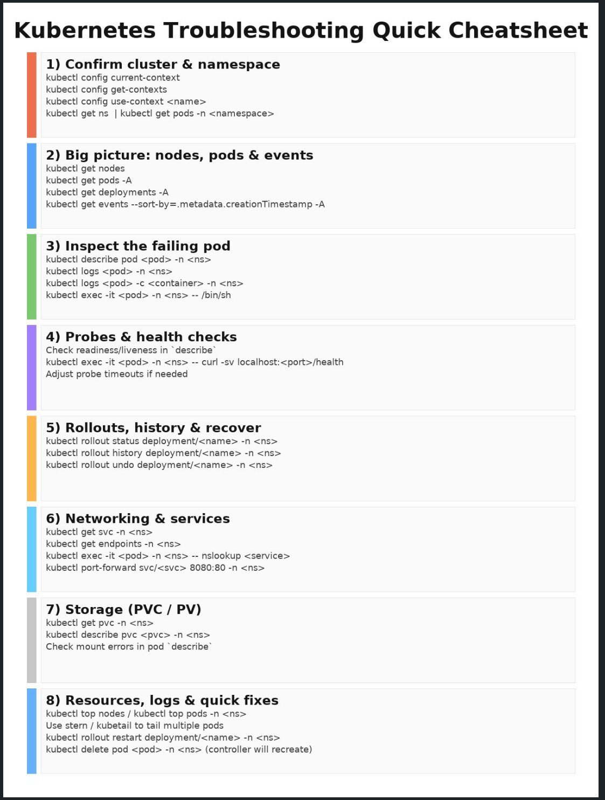

## Kubernetes Cluster Blueprint (Single Cluster, 3 Namespaces, Helm-in-CI)

This blueprint documents a **single Kubernetes cluster** running three application components—**Frontend (React + Nginx)**, **Backend (REST API: Node.js/Java/Go)**, and **Database (PostgreSQL via StatefulSet)**—across three **stable namespaces**: `experimental`, `staging`, `production`. It is designed to align with your **IaC blueprint** (cluster and platform foundations) and your **Delivery/Release blueprint** (Helm-in-CI promotion flow).

---

## 1) Environment Model & Namespace Layout

### Namespaces (stable)
- `experimental`: fast iteration, feature branches deploy here
- `staging`: main branch deployments, pre-prod validation
- `production`: tagged/approved deployments only

### What lives where
- **Same logical stack in each namespace**: frontend + backend + database (unless you decide to externalize DB later).
- **Different settings per environment** via Helm values files:
    - `values-exp.yaml`, `values-staging.yaml`, `values-prod.yaml`

### Baseline namespace guardrails (recommended)
Applied per namespace (created/owned by IaC or a dedicated platform repo—pick one owner):
- RBAC roles and bindings (who can read/deploy/exec)
- ResourceQuota + LimitRange (prevent noisy neighbors, enforce sane defaults)
- NetworkPolicies (default deny + explicit allow)
- Optional: Pod Security restrictions (at least “baseline” level)

---

## 2) Workload Inventory (What You Deploy)

### Frontend (React + Nginx)
- Kubernetes `Deployment` + `Service` (ClusterIP)
- Exposed externally via `Ingress`
- Recommended: `readinessProbe` on `/` (or `/healthz` served by nginx), `livenessProbe` on the same
- Recommended: caching headers, gzip/brotli, and immutable asset caching (CDN later if desired)

### Backend (REST API)
- Kubernetes `Deployment` + `Service` (ClusterIP)
- Receives traffic from Ingress (directly) or via frontend
- Recommended health endpoints:
    - `GET /healthz` (liveness: process is up)
    - `GET /readyz` (readiness: DB reachable, migrations completed, required dependencies reachable)
- Recommended: graceful shutdown handling (termination grace period + preStop if needed)

### Database (PostgreSQL)
- Kubernetes `StatefulSet` + headless `Service`
- Uses `PersistentVolumeClaims` for data
- Recommended:
    - Anti-affinity/topology spread (avoid all replicas on one node/AZ if you run multiple replicas)
    - A clear backup strategy (see “Data & backups” below)

> Note: PostgreSQL inside K8s is workable, but production reliability usually improves with managed DB (your IaC blueprint already hints at RDS later). This blueprint supports StatefulSet now, but encourages a “migrate out” path.

---

## 3) Core Good Practices (Your List, with Practical Notes)

### 3.1 Resource requests/limits (every pod)
- **Requests** ensure scheduling and predictable performance.
- **Limits** prevent a single pod from consuming the node.
- For Java backends, align JVM settings with limits to avoid OOMKills.

### 3.2 Health checks (liveness + readiness everywhere)
- **Readiness** gates traffic (Ingress/Service only routes to ready pods).
- **Liveness** restarts stuck pods.
- For APIs: readiness should fail if DB is unavailable (or if you choose “degraded mode,” document it explicitly).

### 3.3 Replicas (min 2 for frontend and backend)
- Minimum 2 replicas is the baseline for high availability.
- Combine with topology spread across nodes/AZs for real resilience.

### 3.4 HPA (autoscale)
- HPA works best when:
    - requests/limits are set correctly
    - you have reliable metrics
- CPU-based HPA is easiest. Memory-based is possible but often less predictive for APIs; consider request-rate scaling later (via custom metrics) if needed.

### 3.5 Ingress controller (nginx)
- NGINX Ingress Controller handles external routing to frontend/backend.
- Recommended policies:
    - TLS everywhere (cert-manager is a common add-on)
    - rate limiting/WAF later if exposed publicly
    - separate hostnames per environment (e.g., `api-staging.example.com`)

### 3.6 Persistent volumes (PVC for database)
- Use a StorageClass suitable for your cloud (e.g., gp3 on AWS).
- Define PVC size and allow expansion if supported.
- Document retention behavior (what happens on StatefulSet deletion).

### 3.7 Secrets management
- Store DB credentials in **Kubernetes Secrets** at minimum.
- For stronger security and rotation: integrate external secrets later (AWS Secrets Manager / Vault).
- Avoid committing secrets into Git (even “base64 encoded”).

### 3.8 ConfigMaps (externalize configuration)
- Use ConfigMaps for non-sensitive settings.
- Keep environment differences in Helm values → rendered ConfigMaps.

### 3.9 NetworkPolicies (restrict pod-to-pod)
Start with a simple, effective model:
- Default deny ingress/egress per namespace
- Allow:
    - Ingress controller → frontend/backend services
    - frontend → backend (if applicable)
    - backend → database
    - DNS egress to kube-dns
      This prevents accidental cross-talk between namespaces and reduces blast radius.

---

## 4) Additional Elements Worth Including (Recommended)

### 4.1 ServiceAccounts + least-privilege RBAC (per workload)
- Each workload gets its own ServiceAccount.
- Avoid running pods with overly broad permissions.
- CI/CD gets deploy permissions scoped per namespace (ties to your Delivery blueprint).

### 4.2 Pod disruption & scheduling resilience
- **PodDisruptionBudgets (PDBs)** for frontend/backend so node drains don’t take you down.
- **TopologySpreadConstraints** (or pod anti-affinity) to spread replicas across nodes (and ideally across AZs).

### 4.3 Security hardening defaults
- Run as non-root where possible (nginx can be configured for this).
- Drop Linux capabilities, read-only root filesystem when feasible.
- Use image scanning in CI; pin images by digest for production.

### 4.4 Logging, metrics, and tracing hooks (tie into observability)
- Standardize structured logs (JSON for backend is common).
- Emit basic RED metrics (rate, errors, duration).
- Include trace headers propagation (even if tracing backend comes later).

### 4.5 Release safety (fits Helm-in-CI)
- Use rolling updates + readiness probes as the baseline “safe rollout.”
- Add post-deploy smoke tests hitting Ingress endpoints in staging before promoting to production.

---

## 5) Data, Backups, and Recovery (PostgreSQL in K8s)
If you run PostgreSQL as a StatefulSet, explicitly document:
- **Backups**: scheduled logical backups (pg_dump) or physical backups (tooling-specific)
- **Restore procedure**: where backups live and how to restore into a new PVC
- **RPO/RTO targets**: how much data loss is acceptable and how fast recovery must be
- **Migration path**: when/why you would move to managed DB (e.g., RDS) for production

---

## 6) Ownership Boundaries (to avoid “split brain”)
To align with your existing IaC + Delivery blueprints, define clear ownership:

- **IaC owns**: cluster, node groups, storage classes, ingress controller installation (optional), namespaces, baseline RBAC/quotas/networkpolicies.
- **Helm-in-CI owns**: application releases (frontend/backend/db manifests packaged in charts), per-environment values, rollouts and rollbacks.

> Rule: one resource should have one “source of truth” (Terraform *or* Helm), not both.

---

## 7) Minimal “Definition of Done” for Each Namespace
A namespace is considered ready when it has:
- Namespace created + labels/annotations as needed
- RBAC in place (humans + CI)
- ResourceQuota + LimitRange applied
- Default-deny NetworkPolicy + required allow rules
- Ingress routing/TLS configured for that environment
- Observability baseline (logs + metrics available)
- Frontend + backend running with 2+ replicas, probes, and requests/limits
- DB running with PVC + backup plan documented

---

### 8) Helm 

**Helm** is the de-facto package manager for Kubernetes: it lets you define, version, and deploy a set of Kubernetes resources as a single **chart** (templates + default configuration), and then install that chart as a **release** into a namespace with environment-specific **values**. You should use Helm because it turns “a pile of YAML” into a repeatable, parameterized deployment artifact: the same chart can be deployed to `experimental`, `staging`, and `production` by swapping values files, while Helm tracks release history to support upgrades and rollbacks. In your setup (Helm-in-CI, stable namespaces), the healthy “how” is: keep one chart per app (or one umbrella chart per stack), keep **values per environment in Git**, run deterministic upgrades (same chart + same values + same image digest), and treat CI as the actor that performs `upgrade/install` into the target namespace.

**Pros:** fast onboarding and reuse (charts can be shared), strong support across the ecosystem (many third-party apps ship official charts), environment parameterization via values, and built-in release history/rollback mechanics. **Cons/heads-up:** templating can become hard to reason about if charts grow without structure; values sprawl can hide important differences between environments; Helm is not a full “drift detection” system (manual kubectl changes can diverge from what Helm thinks is deployed); and secrets handling needs care (avoid committing sensitive values unless you use an encryption/secret-management workflow). A good rule is to keep charts simple, keep values explicit and documented, validate rendered output in CI, and ensure one clear “owner” of each resource to avoid split-brain (don’t have Terraform and Helm manage the same objects).

**Competitors / alternatives (and when they shine):** plain YAML with `kubectl apply` (simplest but harder to reuse/parameterize), **Kustomize** (overlay-based customization, great for “patching” YAML without templating), and **Jsonnet/Tanka** (powerful but adds a programming layer). For deployment management, **GitOps tools** like Argo CD or Flux often *use Helm or Kustomize under the hood* but add reconciliation, drift detection, and a pull-based model—so they’re not “instead of Helm” as much as “a stronger deployment controller around Helm.”

### 9) Heads Up

Here are the most common gaps for a K8s blueprint:

## 1) Ingress/TLS details (you mention TLS, but not the mechanism)
- **cert-manager** (or an alternative) and *how* certs are issued (Let’s Encrypt, ACM via ALB, internal CA).
- **DNS automation** (e.g., external-dns) vs manual DNS records.
- Per-environment hostname conventions + where the “source of truth” lives.

## 2) Container/runtime security baseline (you hint at it, but not enforceable policy)
- Decide/enforce **Pod Security Admission** level per namespace (`baseline` / `restricted`) and what exceptions exist.
- Standard **securityContext** defaults you want everywhere:
  - runAsNonRoot, readOnlyRootFilesystem, drop capabilities, seccompProfile.
- Image provenance rules: tag policy vs **pin by digest**, allowed registries.

## 3) Supply chain + registry access
- How images are pulled:
  - private registry? then **imagePullSecrets** or IRSA-based auth (ECR on AWS).
- Minimum CI checks you require before deploy (SAST/container scan/SBOM), even if the Delivery blueprint covers some—K8s blueprint should state the expectation.

## 4) Observability “implementation choice”
You mention “hooks,” but teams later get stuck on *what is installed*:
- Metrics stack: **Prometheus/Grafana** (or CloudWatch Container Insights, etc.).
- Logging: fluent-bit / cloud logging agent + retention/PII notes.
- Tracing: OpenTelemetry collector or not.
- Where dashboards/alerts live + minimum “golden signals” alerts per service.

## 5) Workload reliability knobs (often forgotten until first outage)
- **PriorityClasses** (what must survive resource pressure first).
- **Graceful termination** specifics (terminationGracePeriodSeconds + preStop patterns).
- **RollingUpdate settings** (maxUnavailable/maxSurge) for frontend/backend.
- For DB StatefulSet: explicit statement on **replication strategy** (single primary only vs HA) and the operational implications.

## 6) Data protection beyond “backup strategy”
You correctly call out backups, but usually you also want:
- **PVC reclaim policy / deletion behavior** (what happens when release/namespace is deleted).
- Backup destination + encryption + access control.
- A tested **restore drill** cadence (“we actually restore monthly in staging”).

## 7) Policy + governance (to prevent drift and “surprise” changes)
- Whether you want a policy engine: **OPA Gatekeeper / Kyverno** (optional, but worth deciding).
- Rules you’d enforce if you adopt one:
  - require requests/limits, forbid privileged, require probes, restrict hostPath, etc.

## 8) Namespace boundary reality check (one cluster, three namespaces)
If `experimental/staging/prod` share a cluster:
- Call out **blast-radius risks** and how you mitigate them:
  - strict quotas, default-deny egress, separate node pools (optional), stricter RBAC for prod.
- If you plan node separation later, state it (e.g., “prod runs on dedicated node group”).

## 9) “Bootstrap / ownership” clarity for cluster add-ons
You have a good “IaC vs Helm” rule, but the blueprint should explicitly list which team/tool owns:
- Ingress controller installation/upgrade
- cert-manager/external-dns
- metrics/logging agents
- StorageClass defaults

### Command cheatsheet

